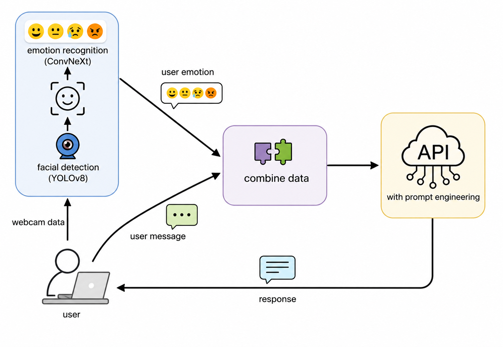

# Psychological Counseling Chatbot

An intelligent psychological counseling chatbot with:

- Emotion recognition using a webcam
- An integrated API to provide flexible responses
- Prompt engineering for customised responses in specific situations

<a href="figures/chatbot.png">
  
</a>

> [!NOTE]
> This is an early learning project maintained primarily as a development record. It does not include complete version management or development history.
>
> This repository may not contain all files and dependencies required to run the application. Please review the project structure, file paths, model checkpoints, and configuration before running it.
> [!TIP]
> The application uses a webcam for real-time emotion recognition. Inference accuracy may be affected by lighting conditions, camera angle, facial position, and the surrounding environment.
>
> When training the emotion-recognition model primarily with static images, the difference between controlled training data and real-world webcam input should be considered. 

## Pipeline

```text
Start face detection using YOLOv8
        ↓
Infer the user's emotion using the trained emotion recognition model
        ↓
Receive the user's text message
        ↓
Combine the emotion information and user message
        ↓
Send the combined input to the API with customised prompt settings
        ↓
Generate and display the response
```
<a href="figures/chatbot_pipeline.png">
  
</a>

## Application Framework

```text
Application
└── Psychological_Counseling_Chatbot.py
    ├── API integration
    ├── User interface launch
    └── Emotion recognition
        ├── yolov8_face.py
        │   ├── Face detection using YOLOv8
        │   └── yolov8n-face.pt
        │       └── Externally pretrained face-detection model
        ├── inference.py
        │   ├── Emotion inference using ConvNeXtV2-Pico
        │   └── checkpoints/run_2025-04-24_18-30/17.pt
        │       └── Self-trained emotion-recognition model based on the AffectNet dataset
        └── emotion_buffer.py
            └── Saves real-time emotion history and extracts emotion information for chatbot input

## Emotion Recognition Training

```text
train_poly.py
dataset.py
```

- **Model:** ConvNeXtV2-Pico
- **Dataset:** AffectNet

## Notes

The YOLOv8 model files and the trained emotion-recognition checkpoint are not included because of their large file sizes.

Testing scripts, intermediate development scripts, and historical versions are also not included.

