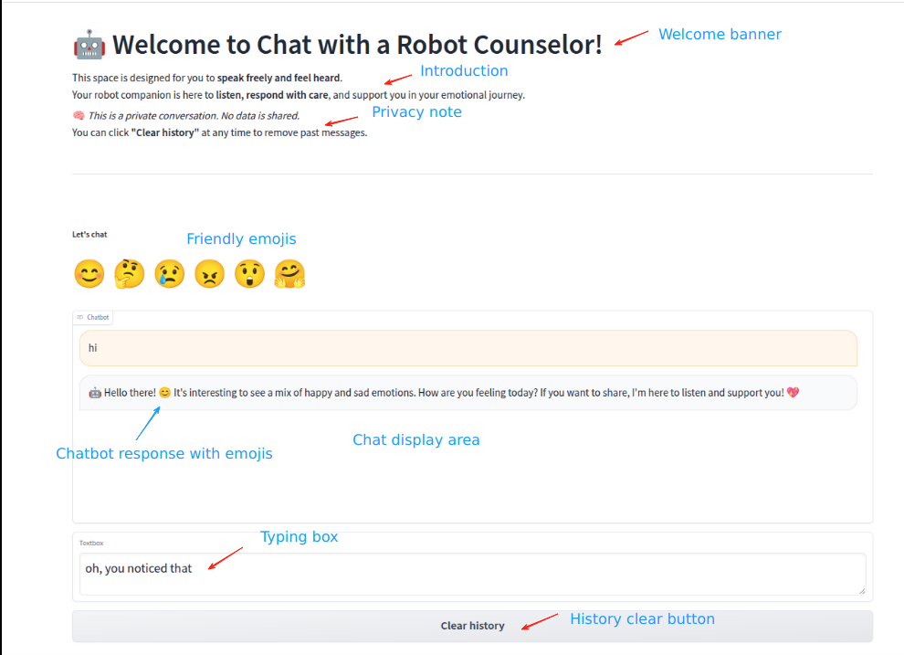

# Psychological Counseling Chatbot

An intelligent psychological counseling chatbot with:

- Emotion recognition using a webcam
- An integrated API to provide flexible responses
- Prompt engineering for customised responses in specific situations

<a href="figures/chatbot.png">
  
</a>

## Pipeline

```text
Start face detection using YOLOv8
        ↓
Infer the user's emotion using the trained emotion recognition model
        ↓
Receive the user's text message
        ↓
Combine the emotion information and user message
        ↓
Send the combined input to the API with customised prompt settings
        ↓
Generate and display the response
```


## Application Framework

```text
Application
└── Psychological_Counseling_Chatbot.py
    ├── API integration
    ├── User interface launch
    └── Emotion recognition
        ├── yolov8_face.py
        │   ├── Face detection using YOLOv8
        │   └── yolov8n-face.pt
        │       └── Externally pretrained face-detection model
        ├── inference.py
        │   ├── Emotion inference using ConvNeXtV2-Pico
        │   └── checkpoints/run_2025-04-24_18-30/17.pt
        │       └── Self-trained emotion-recognition model based on the AffectNet dataset
        └── emotion_buffer.py
            └── Saves real-time emotion history and extracts emotion information for chatbot input

## Emotion Recognition Training

```text
train_poly.py
dataset.py
```

- **Model:** ConvNeXtV2-Pico
- **Dataset:** AffectNet

## Notes

The YOLOv8 model files and the trained emotion-recognition checkpoint are not included because of their large file sizes.

Testing scripts, intermediate development scripts, and historical versions are also not included.

